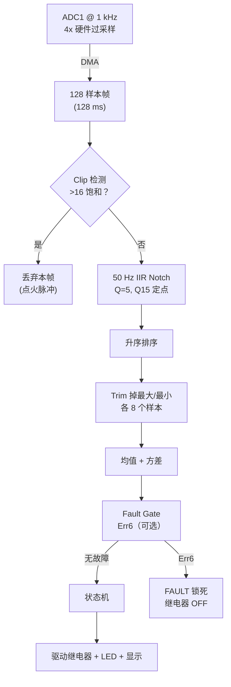
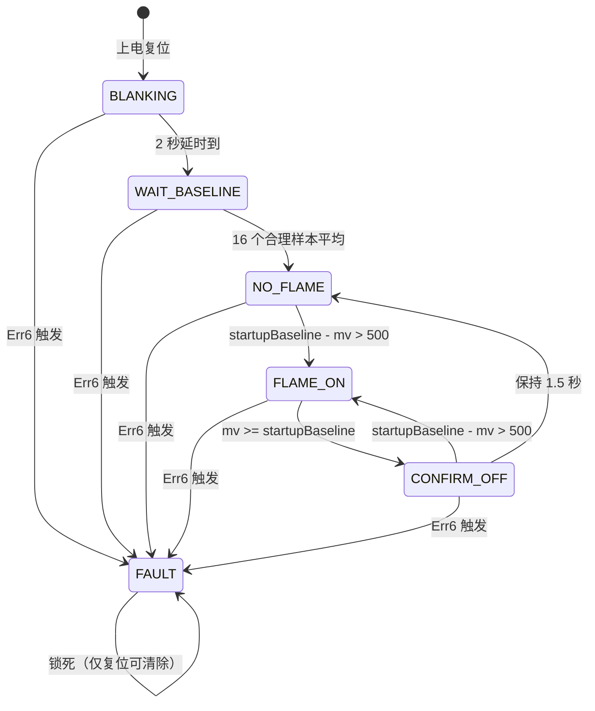
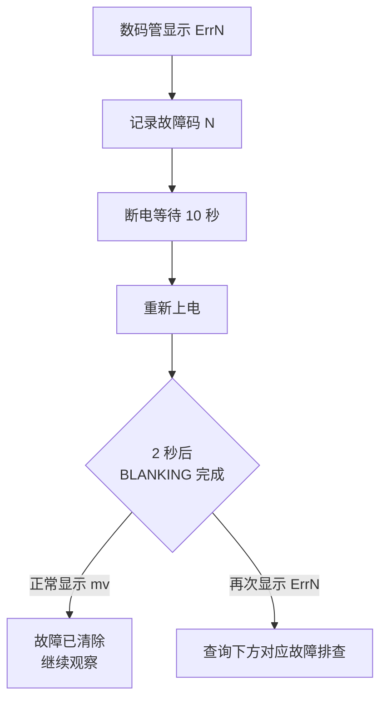

# FlameDetection 工业火焰检测系统

## 操作与维护说明 V1.5.0

> 适用版本：V1.5.0（2026-05-27）
> 适用硬件：STM32G070CB + 离子探针 + TM1650 四位数码管 + 固体/机械继电器

---

## 目录

1. [系统概述](#1-系统概述)
2. [硬件接口](#2-硬件接口)
3. [工作原理](#3-工作原理)
4. [信号处理流水线](#4-信号处理流水线)
5. [状态机和程序流程](#5-状态机和程序流程)
6. [故障码速查表](#6-故障码速查表)
7. [故障排查流程](#7-故障排查流程)
8. [参数调整指南](#8-参数调整指南)
9. [日常维护](#9-日常维护)
10. [在线诊断（J-Link）](#10-在线诊断j-link)
11. [已知局限](#11-已知局限)

---

## 1. 系统概述

### 1.1 功能

- 通过离子探针电压信号判定锅炉火焰有无
- 有火焰 → 闭合燃料继电器（允许供油/供气）
- 无火焰 / 检测故障 → 断开继电器（切断燃料，安全位）
- 四位数码管实时显示探针电压（mV）或故障码（ErrN）
- 指示 LED：熄火慢闪、运行常亮、故障快闪

### 1.2 安全定位

**本系统是燃烧安全控制链中的一环，采用"失效安全"（fail-safe）设计**：任何内部异常 → 继电器断开。绝不会因自身故障造成燃料持续输送。

| 层级 | 机制 |
|---|---|
| 第一层 | 相对上电基线 500 mV 跌幅判定（有火合继电器） |
| 第二层 | 可选 Err6 假火门控（`ENABLE_VARIANCE_CHECK=1` 时生效） |
| 第三层 | 独立看门狗 IWDG（软件死循环 → MCU 自动复位） |
| 第四层 | FAULT 状态复位循环锁死（故障未排除 → 继电器永不合） |

---

## 2. 硬件接口

### 2.1 关键引脚（STM32G070CB）

| 功能 | 引脚 | 说明 |
|---|---|---|
| 探针 ADC 输入 | PA1 | ADC1 CH1，12 位，4× 硬件过采样 |
| 继电器驱动 | PA11 | 推挽输出，高电平吸合 |
| 指示 LED | PA10 | 推挽输出，高电平点亮 |
| TM1650 SCL | PD1 | 软件 IIC 时钟 |
| TM1650 SDA | PD2 | 软件 IIC 数据 |
| SWD IO | PA13 | J-Link 烧录/调试 |
| SWD CLK | PA14 | J-Link 烧录/调试 |

### 2.2 电源要求

| 项 | 范围 | 保护 |
|---|---|---|
| VDDA | 2700 ~ 3600 mV | 仅诊断读取，V1.5.0 不再触发 Err3 |
| MCU 工作 | 64 MHz SYSCLK（内部 HSI16 × 4） | — |

---

## 3. 工作原理

### 3.1 离子探针物理原理

燃烧火焰中的带电粒子（离子 + 电子）在探针 ~100 V 偏置下形成微安级电流。火焰越稳定、燃烧越完全，电流信号越特征化：

| 特征 | 真火焰 | 假信号（湿短路/稳压干扰） |
|---|---|---|
| 电压幅值 | 比上电基线低 > 500 mV | 比上电基线低 > 500 mV 但信号极稳 |
| 自然抖动（variance） | 通常 > 100 LSB² | ≤ 100 LSB²（信号被钳位） |
| 1~15 Hz 闪烁 | 有（燃烧混沌特征） | 无 |

### 3.2 检测判据（V1.5.0）

**上电基线**：`WAIT_BASELINE` 阶段采集 16 帧有效样本（1500~3000 mV）取均值，**固定不变**，运行中不再 EMA 跟踪。

**进入 FLAME_ON（合继电器）**：

1. `startupBaseline - mv > 500 mV`
2. 若 `ENABLE_VARIANCE_CHECK=1`：方差必须 **> 100 LSB²**（否则报 Err6，不合闸）
3. 若 `ENABLE_VARIANCE_CHECK=0`（生产默认）：仅看跌幅，不检查方差

**退出 FLAME_ON（分闸）**：

1. `mv >= startupBaseline`（回到上电基准值）→ 进入 CONFIRM_OFF
2. 保持 1500 ms 后 → NO_FLAME，继电器断开

---

## 4. 信号处理流水线



### 4.1 每一级的作用

| 级 | 作用 | 抗什么干扰 |
|---|---|---|
| 4× 过采样 | 等效低通 @ 250 Hz | 高频噪声 |
| Clip 检测 | 丢弃含 >16 个饱和样本的帧 | 点火变压器 kV 脉冲 |
| 50 Hz Notch | 带阻 45~55 Hz | 工频电磁耦合 |
| 排序 + Trim | 丢最大/最小各 8 个（12.5% 尾部） | 孤立脉冲尖刺 |
| 均值 + 方差 | 112 个中间样本的统计量 | 随机噪声 |
| Fault Gate | 可选 Err6（跌幅 > 500 mV 且方差 ≤ 100） | 湿短路假火 |

### 4.2 帧时序

- ADC 触发：TIM6 TRGO @ 1 kHz → **每 1 ms 一个样本**
- DMA 填满 128 个样本 → **128 ms/帧**
- 主循环：`__WFI()` 休眠 → DMA TC 中断唤醒 → 处理 → 下一帧

---

## 5. 状态机和程序流程

### 5.1 状态转换图



### 5.2 状态含义

| 状态 | 编号 | 继电器 | LED | 数码管 | 持续条件 |
|---|---|---|---|---|---|
| **BLANKING** | 0 | OFF | 慢闪 | 显示 mv | 上电后 2 秒 |
| **WAIT_BASELINE** | 1 | OFF | 慢闪 | 显示 mv | 采 16 个基线样本 |
| **NO_FLAME** | 2 | OFF | 慢闪 | 显示 mv | 检测中，无火焰 |
| **FLAME_ON** | 3 | **ON** | 常亮 | 显示 mv | 火焰确认，允许燃烧 |
| **CONFIRM_OFF** | 4 | ON | 常亮 | 显示 mv | 疑似熄火确认期（1.5 秒） |
| **FAULT** | 5 | **OFF** | 快闪 2 Hz | 显示 **ErrN** | 锁死，等待复位 |

### 5.3 主循环伪代码

```c
main() {
    系统初始化()；
    ADC、DMA、TM1650、GPIO 初始化()；
    IWDG 使能（512 ms 超时）();
    flameInit()；      // 进入 BLANKING
    while (1) {
        flameProcess()；   // 处理一帧（~128 ms）
        HAL_IWDG_Refresh(&hiwdg)；  // 喂狗
    }
}
```

### 5.4 Tick 回调（SysTick @ 1 kHz）

- `flameOffCount` 自增（CONFIRM_OFF 超时判定）
- `firstStartCount` 自增（BLANKING 超时判定）
- FAULT 时 LED 翻转（2 Hz 闪烁视觉反馈）

---

## 6. 故障码速查表

**所有故障都会让继电器立即断开并锁死到 FAULT 状态。只能通过掉电重启清除。**

**V1.5.0 起仅 Err6 可触发 FAULT（且需 `ENABLE_VARIANCE_CHECK=1`）。Err1~5、Err7 已移除。**

| 故障码 | 显示 | 名称 | 物理原因 | 典型场景 |
|---|---|---|---|---|
| **6** | Err6 | SHORT_REL | 相对上电基线跌幅 > 500 mV 且方差 ≤ 100 LSB² | 湿短路/稳压假火（需开启方差检测） |

> Err1~5、Err7 在 V1.4 及以前版本中存在，V1.5.0 已简化移除。若数码管显示这些码，说明运行的是旧版固件。

### 6.1 故障判定（V1.5.0）

**前提**：`ENABLE_VARIANCE_CHECK = 1`（开发/标定用；生产默认 0）

**条件（同时满足）**：

1. 上电基线已采集完成（NO_FLAME / FLAME_ON / CONFIRM_OFF 状态）
2. `startupBaseline - mv > 500 mV`
3. `variance ≤ 100 LSB²`

**结果**：FAULT 锁死，显示 Err6，继电器 OFF。

---

## 7. 故障排查流程

### 7.1 通用复位流程



### 7.2 Err6 (SHORT_REL) — 湿短路 / 假火

**前提**：固件中 `ENABLE_VARIANCE_CHECK=1`。生产默认关闭时不会报 Err6。

**检查顺序**：
1. **探针绝缘是否受潮**（锅炉停机后冷凝水最常见）
2. 探针陶瓷绝缘子是否开裂
3. 探针与周围金属是否因积碳搭接
4. 清洁探针、干燥绝缘子
5. 必要时更换探针

> V1.5.0 已移除 Err1~5、Err7。以下旧版排查节仅供参考。

### 7.3 旧版故障码（V1.4 及以前，已移除）

Err1（硬短路）、Err2（开路）、Err3（VDDA）、Err4（方差死）、Err5（跳变）、Err7（基线漂移）在 V1.5.0 中不再触发。若需恢复，请使用 V1.4 固件或联系开发。

---

## 8. 参数调整指南

**所有可调参数都在 [Inc/main.h](FlameDetection/Inc/main.h)。修改后需重新编译烧录。**

### 8.1 核心检测参数（V1.5.0）

| 参数 | 默认 | 说明 |
|---|---|---|
| `FLAME_ON_DELTA_MV` | 500 | 相对上电基线跌幅超过此值 → 合闸 |
| `FLAME_OFF_TIMEOUT_MS` | 1500 | CONFIRM_OFF 去抖时间（ms） |
| `ENABLE_VARIANCE_CHECK` | **0** | **0=生产（不检方差）；1=开启 Err6 假火门控** |
| `FALSE_FLAME_VAR_MAX` | 100 | LSB²；方差 ≤ 此值且跌幅 > 500 → Err6 |

### 8.2 常用调整

| 参数 | 默认 | 建议范围 | 影响 |
|---|---|---|---|
| `FLAME_ON_DELTA_MV` | 500 | 300~800 | 火焰确认所需 mV 跌幅 |
| `FLAME_OFF_TIMEOUT_MS` | 1500 | 500~3000 | CONFIRM_OFF → NO_FLAME 延迟 |
| `FALSE_FLAME_VAR_MAX` | 100 | 50~500 | Err6 方差上限（仅 ENABLE=1 时） |
| `BASELINE_SANE_MIN_MV` | 1500 | — | 上电采样有效下限 |
| `BASELINE_SANE_MAX_MV` | 3000 | — | 上电采样有效上限 |

### 8.3 安全相关（改动需谨慎）

⚠️ **以下参数涉及失效安全判定，改动需配合现场标定验证**：

| 参数 | 默认 | 风险说明 |
|---|---|---|
| `ENABLE_VARIANCE_CHECK` | 0 | 改为 1 → 湿短路假火报 Err6；生产建议保持 0 |
| `BASELINE_SANE_MIN_MV` | 1500 | 放宽 → 开机短路污染 baseline |
| `BASELINE_SANE_MAX_MV` | 3000 | 放宽 → 开机开路污染 baseline |
| `DISABLE_FAULT_GATE` | 0 | **改为 1 仅用于测试诊断，严禁出厂** |
| `DIAG_SHOW_VARIANCE` | 0 | **改为 1 仅用于现场标定，生产版须为 0** |

---

## 9. 日常维护

### 9.1 日常巡检（每班次）

- 观察数码管显示是否正常（有数字跳动，不是纯 0 或纯 4095）
- 观察 LED 状态是否与锅炉实际运行一致
- 观察继电器动作声音是否正常

### 9.2 定期维护（每周）

- 清洁探针积碳（软布擦拭，勿用腐蚀性溶剂）
- 检查探针绝缘子有无裂纹
- 检查接线端子紧固

### 9.3 重点维护（每月）

- 用砂纸打磨探针金属头
- 测量探针对地绝缘电阻（应 > 10 MΩ）
- 检查继电器触点氧化
- 检查信号线屏蔽层接地

### 9.4 大修（每年）

- 整根更换探针
- 清洁 MCU 板积尘
- 测试全链路：模拟跌幅 > 500 mV → 继电器应合闸；信号回到上电基准 → 1.5 s 后继电器应释放
- 若 `ENABLE_VARIANCE_CHECK=1`：模拟湿短路（跌幅大 + 低方差）→ 应报 Err6

### 9.5 维护记录表建议

| 日期 | 班次 | 观察故障码 | 处理动作 | 操作员 |
|---|---|---|---|---|
| 2026-05-10 | 白班 | 无 | 日常巡检 | — |
| 2026-05-10 | 夜班 | Err7 | 打磨探针 | — |

---

## 10. 在线诊断（J-Link）

**仅限维护工程师使用。现场运行不需要。**

### 10.1 读取运行状态

用 J-Link Commander 执行 `jlink_snap.jlink`，可读取以下内部变量：

| 变量 | 含义 | 正常范围 |
|---|---|---|
| `flameState` | 当前状态（0~5） | 见 §5.2 |
| `faultCode` | 当前故障码（0~6） | V1.5.0 仅 Err6 可非零 |
| `lastAdcMv` | 当前探针电压 mV | 1500~3000 |
| `startupBaselineMv` | 上电固定基线 mV | 2500~2800 |
| `cachedVddaMv` | 当前 VDDA mV | 2700~3600 |
| `dieTempC` | MCU 芯片温度 °C | 20~70 |
| `lastVariance` | 上一帧方差 LSB² | 诊断用 |

### 10.2 J-Link 连接故障

- "Can not attach to CPU" → 检查 SWDIO/SWCLK 接线是否反
- "Verification of RAMCode failed" → SWD 速率太高，降到 **speed 1000**
- 目标电压 0 V → 被检板子没上电

---

## 11. 已知局限

### 11.1 当前不具备的能力

| 能力 | 状态 | 升级路径 |
|---|---|---|
| 真正的 manual-reset latch（UL-296） | ❌ | 需加 VBAT + RTC BKP，当前硬件不支持 |
| 火焰类型识别（天然气/燃油/煤粉） | ❌ | 需加 Goertzel 频谱分析 |
| 远程监控 / 数据上报 | ❌ | 需加通讯模块（RS485/以太网） |
| 历史故障记录 | ❌ | 需加 Flash 日志或外部 EEPROM |

### 11.2 当前防护边界

- **50 Hz 陷波带宽**：只杀 45~55 Hz。若现场有 100 Hz 二次谐波强干扰，需加第二级 notch
- **点火脉冲帧丢弃**：假设点火脉冲 < 128 ms。若点火期更长，会多丢几帧（安全但响应略慢）
- **V1.5.0 不再检测开路/VDDA/跳变/基线漂移**：这些需靠外部电路或人工巡检
- **生产默认不开启方差检测**：湿短路假火在 `ENABLE_VARIANCE_CHECK=0` 时可能误合闸

### 11.3 版本演进

| 版本 | 日期 | 关键改进 |
|---|---|---|
| V1.0.0 | 2026-05-08 | 初版：DMA 采样 + 故障门 + 自恢复 |
| V1.1.0 | 2026-05-09 | 相对短路检测 + sticky FAULT |
| V1.2.0 | 2026-05-09 | Err6 SHORT_REL + baseline sanity guard + TM1650 每帧重发亮度 |
| V1.3.0 | 2026-05-09 | 50 Hz notch + 点火帧丢弃 + Err7 DRIFT |
| V1.4.0 | 2026-05-11 | 现场实测重平衡：FAULT_FLOOR 500→250 mV、短路判据全改方差门控 |
| V1.5.0 | 2026-05-27 | 简化检测：固定上电基线、500 mV 合闸、基准值分闸；仅保留可选 Err6 |

---

## 附录 A：故障码快速卡片（打印贴在控制柜）

| 显示 | 含义 | 触发条件（V1.5.0） | 一分钟处理 |
|---|---|---|---|
| **Err6** | **探针湿短路/假火** | `ENABLE_VARIANCE_CHECK=1` 且跌幅 > 500 mV 且方差 ≤ 100 LSB² | **清洁绝缘子** |

> 生产固件默认 `ENABLE_VARIANCE_CHECK=0`，通常不会显示 Err6。

**所有故障处理完后必须断电重启才能清除。**

---

## 附录 B：联系方式

- 技术支持：<待填写>
- 源代码仓库：<https://github.com/wmstianya/FlameDetection>（renew 分支）
- 本文档版本：V1.5.0，更新于 2026-05-27

